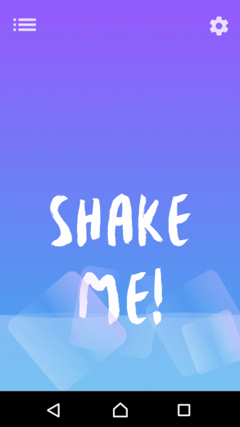

# shake
Mix a cocktail by shaking your Android smartphone!

My friend Anne Muenzner and I taught a seminar session where we introduced the functionality of Android sensors to our classmates. We prepared a simple native Android app that uses the accelerometer of the smartphone. Following our presentation (in German, see pdf), the students had to add some lines of code and were able to test the effect by shaking their phone and mixing a cocktail. Based on principles of usability, the app gives feedback on the current state of the cocktail by a [wave animation](https://github.com/john990/WaveView) with increasing "sea level". Once it reaches the top of the screen, the final cocktail is presented. You can then rotate the phone and the wave moves accordingly. **Cheers!**

